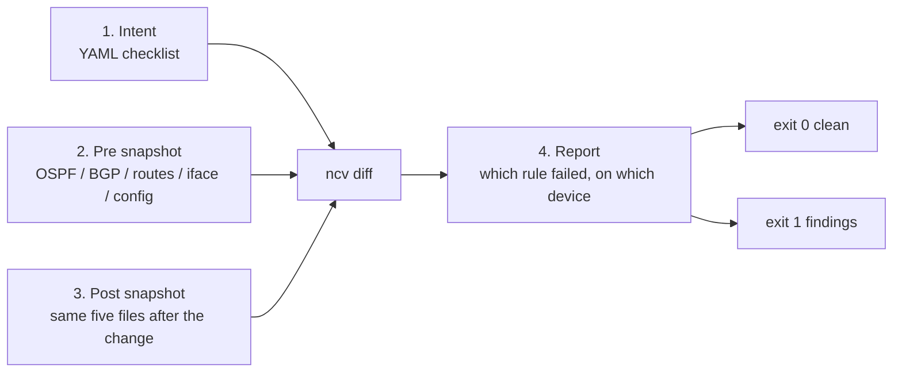
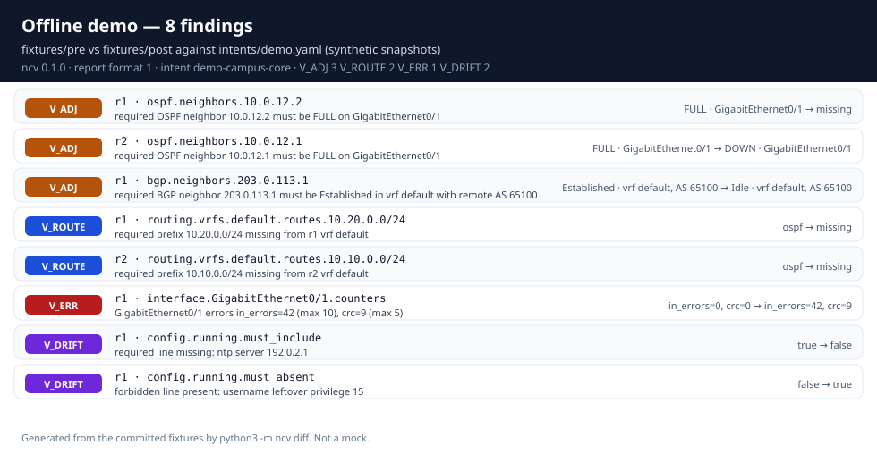
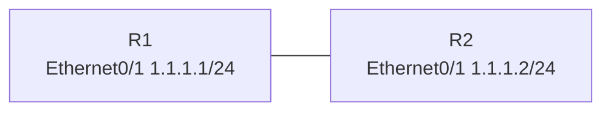
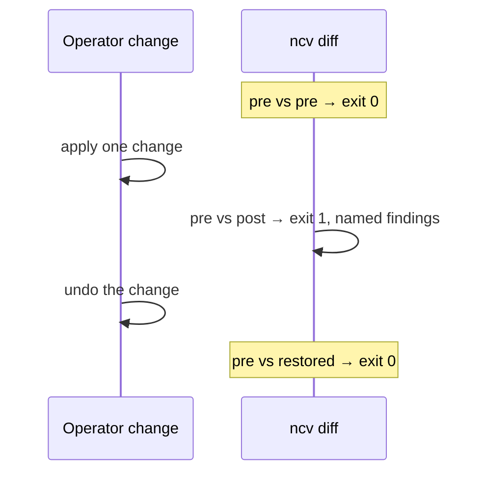
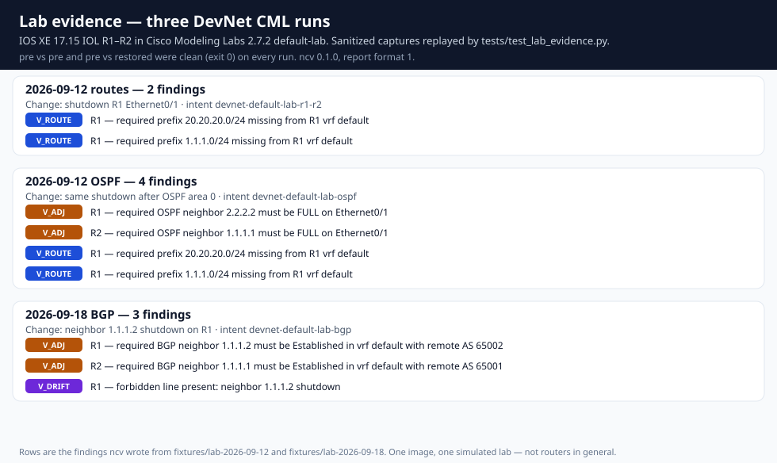
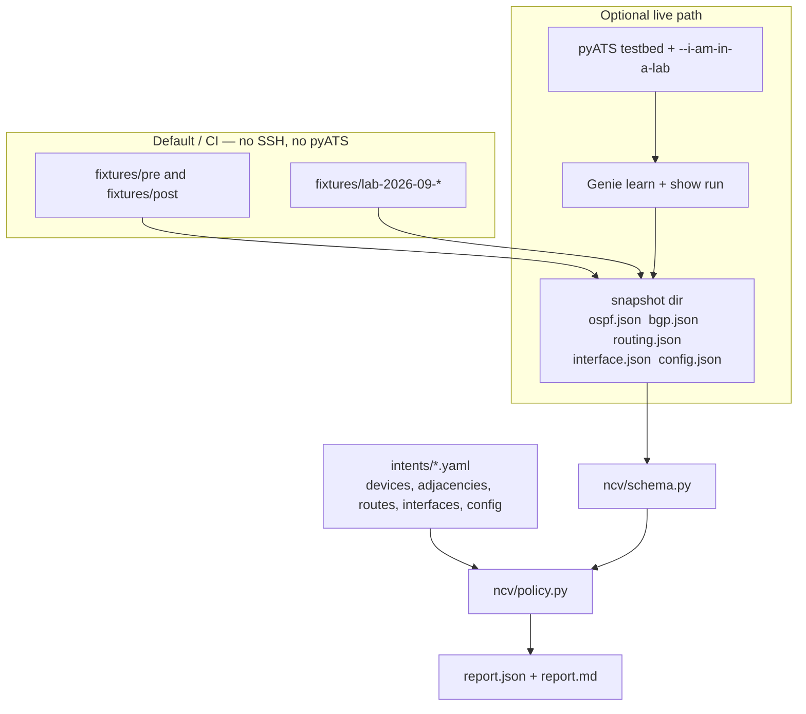

# network-change-validator

**A checklist for a network change.** You write the rules you care about. The tool
compares saved before/after snapshots to that checklist and names every rule that
failed.

- **Fixtures (default and CI):** synthetic, hand-authored snapshots. No SSH or pyATS.
- **Lab evidence:** sanitized captures from three live runs against a Cisco DevNet
  CML sandbox, replayed by the tests. See
  [fixtures/lab-2026-09-12](fixtures/lab-2026-09-12/SOURCE.md) and
  [fixtures/lab-2026-09-18](fixtures/lab-2026-09-18/SOURCE.md).
- **Live (optional):** collect from a lab you own using pyATS/Genie. Requires
  `--i-am-in-a-lab` on every capture.

This is not a home Wi-Fi tool or a production change tool. It has no configuration
push or fault-application command. The demo fixtures are synthetic
([provenance](fixtures/SOURCE.md)); the lab evidence comes from one simulated lab.
Neither demonstrates a production deployment.



## What it checks

| Policy | Question it answers |
|---|---|
| `V_ADJ` | Is the required OSPF neighbor **FULL** on that interface? Is the required BGP peer **Established**? |
| `V_ROUTE` | Is the required prefix still in the VRF (and via that protocol, if you named one)? |
| `V_ERR` | Are the named interface counters at or under their limits? |
| `V_DRIFT` | Are the required config lines present, and the forbidden ones gone? |

Rules judge **post-state against intent**. Pre-state is shown as context. A finding is
not proof that the change *caused* the break.

## Results you can replay

The pictures and tables below are the reports `ncv` 0.1.0 wrote from the committed
fixtures. They are checked in under [docs/artifacts](docs/artifacts/SOURCE.md).
Rebuild them with `PYTHONPATH=src python3 scripts/render_artifacts.py`.

### Offline demo (synthetic fixtures)

```bash
python3 -m pip install -e ".[dev]"
python3 -m pytest
python3 -m ncv diff fixtures/pre fixtures/post --intent intents/demo.yaml --report output/demo
```

`pytest` is **93 tests**. The last command exits **1** and writes
`output/demo/report.md`. That run produced **8 findings** —
`V_ADJ` 3, `V_ROUTE` 2, `V_ERR` 1, `V_DRIFT` 2:



Same snapshots against themselves stay clean:

```bash
python3 -m ncv diff fixtures/pre fixtures/pre --intent intents/demo.yaml --report output/clean
# exit 0, zero findings
```

The report `ncv` wrote for the failing pair (also
[docs/artifacts/demo-report.md](docs/artifacts/demo-report.md)):

```markdown
# Change validation — demo-campus-core

Findings: **8**

| policy | device | path | why |
|---|---|---|---|
| V_ADJ | r1 | ospf.neighbors.10.0.12.2 | required OSPF neighbor 10.0.12.2 must be FULL on GigabitEthernet0/1 |
| V_ADJ | r2 | ospf.neighbors.10.0.12.1 | required OSPF neighbor 10.0.12.1 must be FULL on GigabitEthernet0/1 |
| V_ADJ | r1 | bgp.neighbors.203.0.113.1 | required BGP neighbor 203.0.113.1 must be Established in vrf default with remote AS 65100 |
| V_ROUTE | r1 | routing.vrfs.default.routes.10.20.0.0/24 | required prefix 10.20.0.0/24 missing from r1 vrf default |
| V_ROUTE | r2 | routing.vrfs.default.routes.10.10.0.0/24 | required prefix 10.10.0.0/24 missing from r2 vrf default |
| V_ERR | r1 | interface.GigabitEthernet0/1.counters | GigabitEthernet0/1 errors in_errors=42 (max 10), crc=9 (max 5) |
| V_DRIFT | r1 | config.running.must_include | required line missing: ntp server 192.0.2.1 |
| V_DRIFT | r1 | config.running.must_absent | forbidden line present: username leftover privilege 15 |

_ncv 0.1.0, report format 1._
```

Each finding also carries both states, so the JSON is readable without the
snapshots beside it. From [docs/artifacts/demo-report.json](docs/artifacts/demo-report.json):

```json
{
  "policy_id": "V_ADJ",
  "device": "r1",
  "path": "bgp.neighbors.203.0.113.1",
  "before": {
    "state": "Established",
    "vrf": "default",
    "remote_as": 65100
  },
  "after": {
    "state": "Idle",
    "vrf": "default",
    "remote_as": 65100
  },
  "why": "required BGP neighbor 203.0.113.1 must be Established in vrf default with remote AS 65100",
  "action": "inspect the peer session, its vrf, and its remote AS in the lab"
}
```

Exit codes: **0** = no findings / successful snapshot; **1** = policy findings;
**2** = invalid arguments, unreadable/malformed input, collection failure, or output error.
A report is meaningful only when its command exits 0 or 1; a failed rerun does not
remove reports from a previous run.

Both reports record the JSON format version and the `ncv` version that wrote them.
`python3 -m ncv --version` prints the same version (`0.1.0` today).

### Live lab (Cisco DevNet CML)

Three runs, same two IOS XE 17.15 IOL routers in the CML 2.7.2 `default-lab`,
reached through the console server. Each run is sanitized in-repo and replayed by
`tests/test_lab_evidence.py`.







| Date | Change | `ncv diff` pre vs post | Report |
|---|---|---|---|
| 2026-09-12 routes | `shutdown` on R1 Ethernet0/1 | exit 1, 2 findings: `V_ROUTE` on R1 for `20.20.20.0/24` (was static) and `1.1.1.0/24` (was connected) | [report](docs/artifacts/lab-2026-09-12-routes-post.md) |
| 2026-09-12 OSPF | same shutdown, OSPF area 0 on the link | exit 1, 4 findings: `V_ADJ` R1 neighbor 2.2.2.2 and R2 neighbor 1.1.1.1 gone, plus those two R1 routes | [report](docs/artifacts/lab-2026-09-12-ospf-post.md) |
| 2026-09-18 BGP | `neighbor 1.1.1.2 shutdown` on R1 | exit 1, 3 findings: both peers Idle (`V_ADJ`) and forbidden line `neighbor 1.1.1.2 shutdown` on R1 (`V_DRIFT`) | [report](docs/artifacts/lab-2026-09-18-bgp-post.md) |

On every run, `pre` vs `pre` and `pre` vs `restored` exited **0** with zero findings.
R2's end of the link stayed up in the route simulation, so R2's route rules stayed
compliant on that run. The BGP change was an administrative peer shutdown, not a
link shutdown; the static routes outranked learned prefixes, so the routing table
did not move.

That is evidence about IOS XE 17.15 on IOL in that lab, not about routers in general.

## How the pieces fit



- Missing evidence for a requested post-state check is a **finding**, never an assumed zero.
- An entirely empty snapshot is an **input error**.
- Snapshot output must be a new or empty directory. Publication happens only after
  every write succeeds, so a failed capture does not leave a partial snapshot.
- `exclude_volatile` is accepted for compatibility and does not filter anything.

## Intent and evidence

Start with [intents/demo.yaml](intents/demo.yaml). Version 1 validates declared
devices and optional `adjacencies`, `routes`, `interfaces`, and `config` sections.
Unknown intent fields, unsupported adjacency protocols, invalid prefixes, and
invalid counter limits are rejected with field context.

Snapshots use up to five JSON files: `ospf.json`, `bgp.json`, `routing.json`,
`interface.json`, and `config.json`. Each maps device names to normalized evidence.
Malformed data is an input error.

Copy a validated snapshot without connecting to devices:

```bash
python3 -m ncv snapshot --from-dir fixtures/pre --output captures/example
```

Copying validates the input and preserves `SOURCE.json` when supplied.

Policy details:

- OSPF checks require FULL (including `FULL/DR`-style states), not merely UP.
  Interface names match exactly; omit `interface` to check state alone.
- BGP checks require an Established session, matched case-insensitively. `vrf` and
  `remote_as` are optional discriminators, checked only when the intent declares them.
- An adjacency carries the fields of its own protocol: `interface` belongs to `ospf`,
  `vrf` and `remote_as` to `bgp`. The wrong pairing is rejected by name.
- Route checks cover presence and optional protocol, not reachability or next-hop correctness.
- Counter limits are inclusive maxima for **absolute post counters**, not pre/post
  deltas. Missing counters fail the check. Interface operational status is not a rule.
- Config rules compare complete lines after trimming leading/trailing whitespace.
  They do not use substring, regex, or configuration-hierarchy matching.
- Only explicitly implemented policy fields are inspected; unrelated timers and
  octet counters do not affect results.

## Optional live path and limitations

See [docs/LIVE.md](docs/LIVE.md). Live collection uses a deliberately small Genie
adapter for OSPF, BGP, routing, and interface state plus `show running-config`.
Pass `--features` to narrow that set to what a given lab actually runs.
Unsupported shapes are rejected, as is the same neighbor seen twice: an OSPF peer
across interfaces or VRFs, or a BGP peer across VRFs or instances.
It is not a general multi-vendor framework.

A step-by-step runbook for a first capture against a Cisco DevNet sandbox, including
the reason it cannot run on native Windows, is in [docs/LIVE.md](docs/LIVE.md).
[intents/lab.yaml.example](intents/lab.yaml.example) is the intent template to copy, and
[testbeds/cml-console.yaml.example](testbeds/cml-console.yaml.example) is the testbed for
reaching CML nodes through the console server. The scripts that drove the lab runs, and
the sanitizer that prepared their evidence, are in [scripts/lab](scripts/lab/README.md).
Those scripts push configuration to the lab by design; `ncv` itself never does.

Tests use synthetic data and mocked connections. They verify the lab flag,
initialization safeguards, normalization, cleanup, and failure reporting **without
pyATS installed**. Three live runs have happened, two on 2026-09-12 and one on
2026-09-18, all against two IOS XE 17.15 routers (IOL) in a Cisco DevNet CML sandbox.

## Development

Lint and formatting are enforced by [Ruff](https://docs.astral.sh/ruff/), which the
`dev` extra installs and `pyproject.toml` configures (line length 110, target
py310, `E`/`F`/`I`/`UP`/`B`/`SIM`):

```bash
python3 -m ruff check .
python3 -m ruff format --check .
```

Tests mirror the module under test — `tests/test_policy.py` covers `ncv/policy.py`,
and so on — with the shared repository paths, demo intent/snapshots, and fake-lab
fixtures in `tests/conftest.py`. Snapshot section validation lives in `ncv/schema.py`
so the snapshot loader and the Genie normalizer share one definition.

CI runs both Ruff checks, the test suite, and the fixture diff gates on Ubuntu
(Python 3.10 and 3.12) and Windows (Python 3.11), always with pyATS and Genie
absent so the offline path is what gets exercised. Each job publishes the findings
table from its own fixture gate to the run summary.

For an interview walkthrough, see [docs/EXPLAIN.md](docs/EXPLAIN.md).
