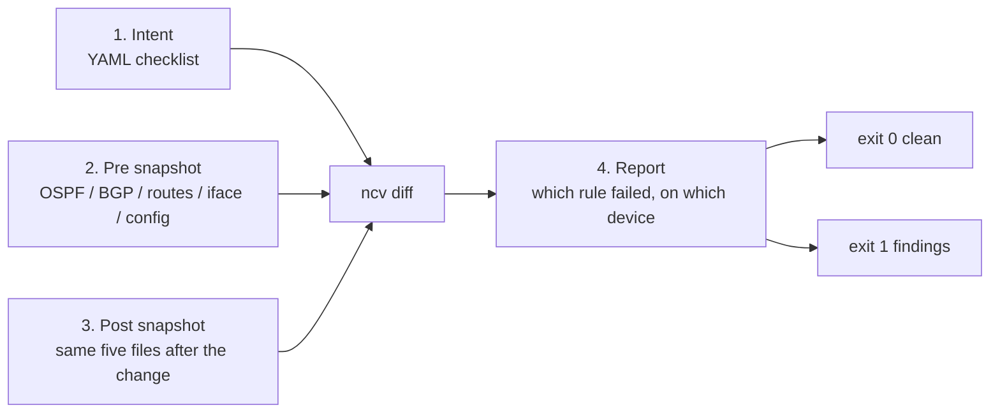
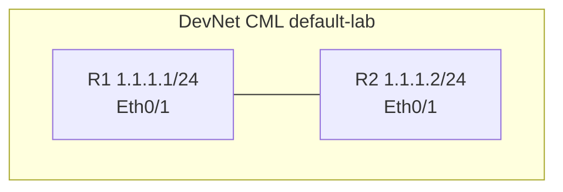
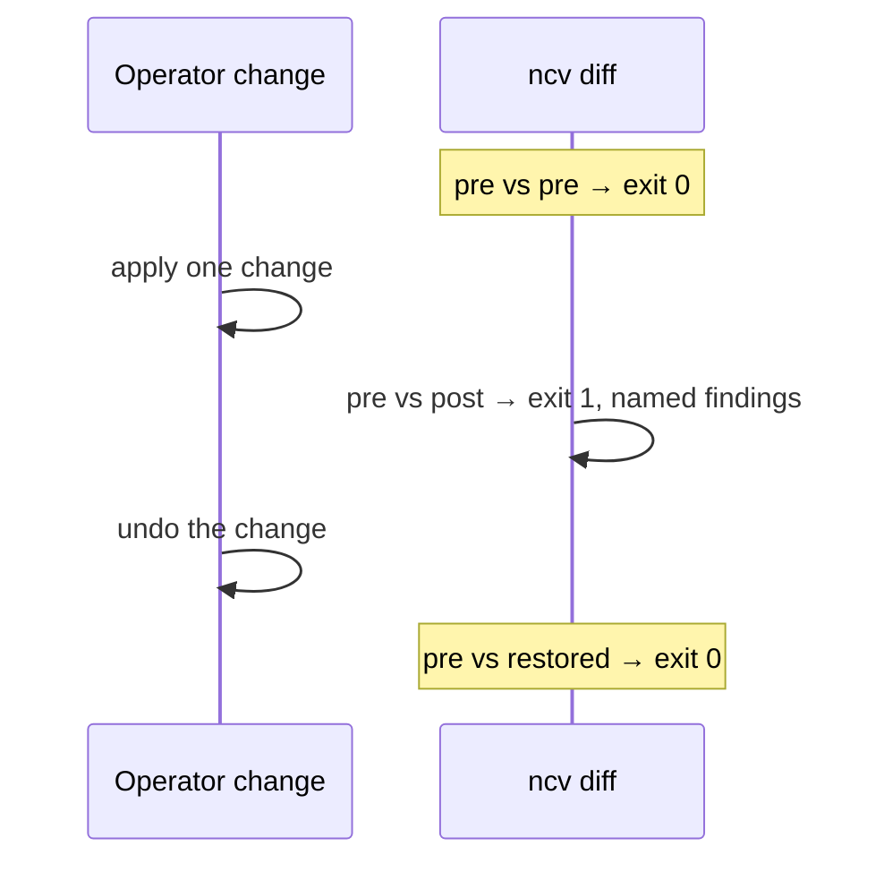
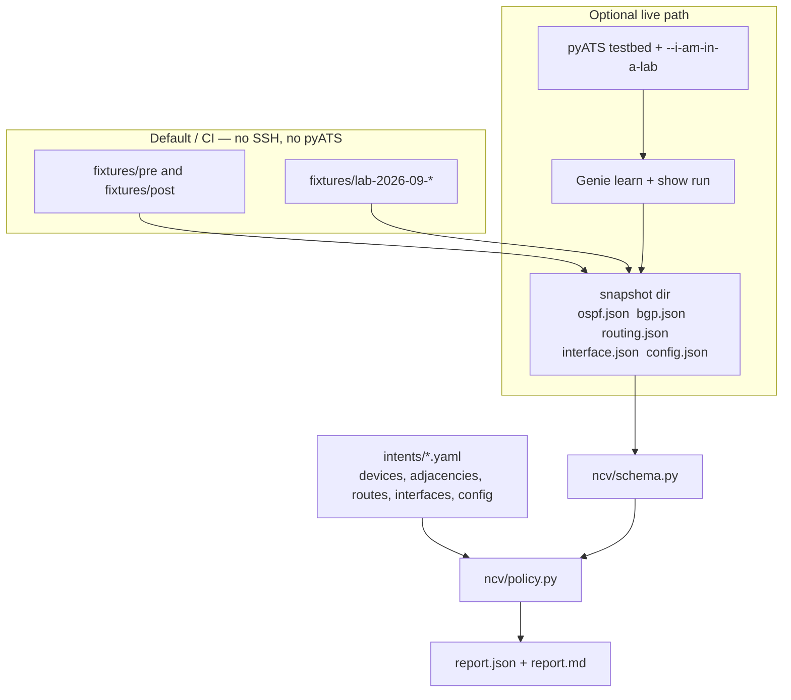

# network-change-validator

**A checklist for a network change.** You write the rules you care about. The tool
compares saved before/after snapshots to that checklist and names every rule that
failed.

It does **not** push configuration, manage Wi-Fi, or run in production. Fixtures and CI
are offline. Live capture is optional and lab-only.



## What it checks

| Policy | Question it answers |
|---|---|
| `V_ADJ` | Is the required OSPF neighbor **FULL** on that interface? Is the required BGP peer **Established**? |
| `V_ROUTE` | Is the required prefix still in the VRF (and via that protocol, if you named one)? |
| `V_ERR` | Are the named interface counters at or under their limits? |
| `V_DRIFT` | Are the required config lines present, and the forbidden ones gone? |

Rules judge **post-state against intent**. Pre-state is shown as context. A finding is
not proof that the change *caused* the break.

## Results you can replay

### Offline demo (synthetic fixtures)

```bash
python3 -m pip install -e ".[dev]"
python3 -m pytest                          # 93 tests
python3 -m ncv diff fixtures/pre fixtures/post --intent intents/demo.yaml --report output/demo
```

The last command exits **1** on purpose and writes `output/demo/report.md`.
**8 findings across all four classes:**

| Policy | Count | Example |
|---|---:|---|
| `V_ADJ` | 3 | BGP neighbor `203.0.113.1` went Established → Idle |
| `V_ROUTE` | 2 | Required prefix missing after the change |
| `V_ERR` | 1 | Interface counter over its limit |
| `V_DRIFT` | 2 | Required / forbidden config line mismatch |

Same snapshots against themselves stay clean:

```bash
python3 -m ncv diff fixtures/pre fixtures/pre --intent intents/demo.yaml --report output/clean
# exit 0, zero findings
```

A finding names the rule, device, evidence path, both states, and what to look at:

```json
{
  "policy_id": "V_ADJ",
  "device": "r1",
  "path": "bgp.neighbors.203.0.113.1",
  "before": { "state": "Established", "vrf": "default", "remote_as": 65100 },
  "after":  { "state": "Idle",         "vrf": "default", "remote_as": 65100 },
  "why": "required BGP neighbor 203.0.113.1 must be Established in vrf default with remote AS 65100",
  "action": "inspect the peer session, its vrf, and its remote AS in the lab"
}
```

### Live lab (Cisco DevNet CML, two IOS XE 17.15 IOL routers)

Same two-router link in three runs. Each run is sanitized in-repo and replayed by
`tests/test_lab_evidence.py`.





| Date | Change | Findings |
|---|---|---|
| 2026-09-12 routes | `shutdown` on R1 Eth0/1 | 2× `V_ROUTE` on R1 (missing `1.1.1.0/24` and `20.20.20.0/24`) |
| 2026-09-12 OSPF | same shutdown, OSPF area 0 on the link | 2× `V_ADJ` (both neighbors gone) + those 2 routes |
| 2026-09-18 BGP | `neighbor 1.1.1.2 shutdown` on R1 | 2× `V_ADJ` (both peers Idle) + 1× `V_DRIFT` (forbidden config line) |

Every restored comparison was clean. Evidence and caveats:
[lab-2026-09-12](fixtures/lab-2026-09-12/SOURCE.md),
[lab-2026-09-18](fixtures/lab-2026-09-18/SOURCE.md).
That is one image in one simulated lab, not routers in general.

## How the pieces fit



- Missing evidence for a requested check is a **finding**, not a silent pass.
- An empty or malformed snapshot is an **input error** (exit 2), not a clean report.
- Exit codes: **0** clean / successful snapshot, **1** policy findings, **2** bad input or collection failure.
- Reports record `report_version` and `ncv_version`. `python3 -m ncv --version` prints the same version.

## Intent and snapshots

Start with [intents/demo.yaml](intents/demo.yaml). Version 1 validates declared devices
and optional `adjacencies`, `routes`, `interfaces`, and `config` sections. Unknown fields,
unsupported adjacency protocols, invalid prefixes, and invalid counter limits are rejected
with field context.

Copy a validated snapshot without touching a device:

```bash
python3 -m ncv snapshot --from-dir fixtures/pre --output captures/example
```

Policy notes worth knowing before you write an intent:

- OSPF must be FULL (including `FULL/DR`). Interface names match exactly; omit `interface` to check state only.
- BGP must be Established (case-insensitive). `vrf` and `remote_as` are optional and checked only when declared.
- `interface` belongs to OSPF; `vrf` / `remote_as` belong to BGP. The wrong pairing is rejected by name.
- Route checks are presence (and optional protocol), not reachability or next-hop correctness.
- Counter limits are inclusive maxima on **absolute post counters**, not pre/post deltas.
- Config rules compare whole trimmed lines. No substring, regex, or hierarchy match.
- `exclude_volatile` is accepted and ignored. Only implemented fields are inspected.

## Live capture (optional)

See [docs/LIVE.md](docs/LIVE.md). You need `--testbed`, `--output`, and `--i-am-in-a-lab`.
`--features` narrows what Genie learns to what the lab actually runs.

Templates: [intents/lab.yaml.example](intents/lab.yaml.example),
[testbeds/cml-console.yaml.example](testbeds/cml-console.yaml.example).
The scripts that drove the three lab runs live in [scripts/lab](scripts/lab/README.md).
Those scripts push config to the lab; `ncv` itself never does.

## Development

```bash
python3 -m ruff check .
python3 -m ruff format --check .
python3 -m pytest
```

CI runs Ruff, the suite, and the fixture gates on Ubuntu (3.10, 3.12) and Windows (3.11),
with pyATS and Genie **absent**, so the offline path is what gets tested. Each job prints
its findings table on the run summary.

Interview one-pager: [docs/EXPLAIN.md](docs/EXPLAIN.md).
